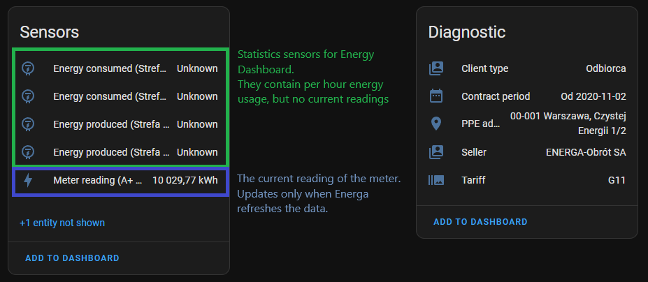
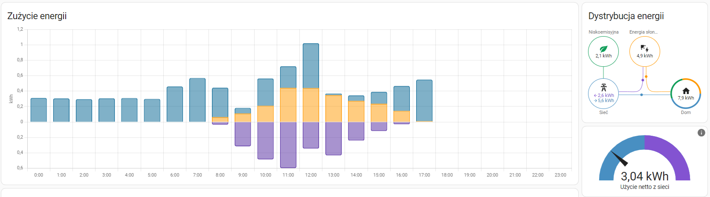

# hass-energa-my-meter

[Home Assistant](https://www.home-assistant.io/) custom integration to gather data from the
Energa My Meter (https://mojlicznik.energa-operator.pl/) website.

## Features

This integration will include the following entities to Home Assistant:



| Parameter         | Description                                                                                                                                                                                                       |
|-------------------|-------------------------------------------------------------------------------------------------------------------------------------------------------------------------------------------------------------------|
| Meter reading     | The latest reading in `kWh` for the specified meter. Will not contain per hour data.                                                                                                                              |
| Client type       | The reading of the client type specified for the account on Energa website. For example: `Odbiorca`                                                                                                               |
| Contract period   | The reading of the contract start / end, as provided on Energa website                                                                                                                                            |
| ID                | The internal meter's ID for Energa. It seems that the REST API for Energa does not use the meter number, but uses (probably) database ID instead                                                                  |
| Last update       | The information about when was the last update published on the Energa website (**not** when it was updated in Home Assistant). This can be used to determine how often Energa refreshes the data on the account. |
| PPE address       | The physical address for the PPE, as provided by Energa                                                                                                                                                           |
| Seller            | The name of energy seller, as provided by Energa                                                                                                                                                                  |
| Tariff            | The name of the tariff type used by the meter                                                                                                                                                                     |
| Energy statistics | Historical readings for the energy used/produced sensor. More about them in the [Statistic sensors](#statistics-sensors) section.                                                                                 |

#### Statistics sensors

This integration does support per hour energy produced/consumed data that can be used in the Energy dashboard:


Because Energa rarely updates the data on their website, the integration needs to create special "statistic" entities
that store no state, but save the hourly usage Energa provides. The integration also supports loading old data from
previous days. In the configuration options you can specify how many days should be loaded on the initial run -
after that the integration will load only the missing data from the last loaded historical point.

**All statistics sensors will be shown in the Home Assistant as _Unknown_ state** - and that is OK, they should be used
only to populate the data in the Energy dashboard. This is due to Home Assistant limitation that you cannot save old
statistic point if the sensor already has some state. Could be possibly enhanced in the future.

This integration will create a set of statistics for each zone your tariff supports.

If you wish not to load any statistics, then do not select any mode during the configuration of the component.

#### Fetching historical data

If you want to load historical data, you can do so by providing the number of days to load parameter during the
configuration.

If the data you want to load is older than 60 days, please keep in mind, that the **integration does not download all
requested data at once**. Instead, it will fetch it with smaller packages of 60 days to avoid issues with Energa website
returning bot-protection errors like captcha requirement.

This means that the component will slowly load the missing data with each iteration (by default, after every 6h). 
To make it load faster, you can set up the `Refresh data interval in minutes` configuration option for your config entry
(the `Configure` button in Home Assistant) to a much smaller value (like 10 minutes) until the integration will fetch 
the freshest data - or reload the entry manually in Home Assistant.

#### Reloading the data

If you wish to completely reload the data, you will need to:

1. **Delete your config/integration entry**
    - To do so, navigate to `Settings` -> `Integrations` -> Energa integration (Mój licznik)
    - Remove the entry you want to reload
2. **Delete statistics associated with this config entry**
    - This step is important! Home Assistant stores statistics in the database even after integration removal,
      so it needs to be done manually. Without it, re-adding the entry will just continue appending the data loaded
      by the deleted entry.
    - To do so, navigate to `Developer tools` -> `Statistics` -> Search for `energa`
    - For the removed entry, the statistics will have the `Fix issue` button, which will open a modal with `Delete`
      option. Please delete all statistics related to deleted entry (for all selected zones & modes).
3. **Add your config entry again**
    - The component will initially load the old data, then continue fetching missing hours reported by Energa.

## Energa My Meter integration issues / Known problems

1. This component **uses webscraping** method - this means that it can break with any change Energa does with its
   website. It is done this way because Energa does NOT have a proper REST API that allows to gather any data.
   Until something changes on Energa side (publishing a proper REST API), this cannot be changed.
2. It is worth mentioning that this integration has **no way of forcing update on the data presented by Energa**. This
   means that we can only get information about the recent usage as often as Energa updates it itself on the website.
   For each meter this means different refresh intervals - it can be once a day or even slower.

## Installation

This integration is a standard Home Assistant custom component and there are many tutorials on how to install it.

### Manual

All you have to do is place the [energa_my_meter](custom_components/energa_my_meter) directory inside your
`/config/custom_components/` directory (if the `custom_components` does not exist, simply create it).

### HACS

Because HACS does not allow Gitlab repositories to be added (and the original repository is hosted on
https://gitlab.com/home-assistant-custom-components/hass-energa-my-meter), there is a GitHub mirror hosted on
https://github.com/thedeemling/hass-energa-my-meter. This integration should be enlisted in HACS default repositories.

## Configuration

This integration supports adding multiple Energa accounts and meters/PPEs by creating additional config entries.

### Config flow

This custom component does support GUI installation. In your Home Assistant instance please search for Energa
integration or simply click on button below
(if you have configured the [My Home Assistant](https://my.home-assistant.io/)) to add it.

[](https://my.home-assistant.io/redirect/config_flow_start/?domain=energa_my_meter)

The configuration wizard will provide the details about possible configuration options.

You can also change the interval of refreshing the data (by default 5 hours) to best suit your needs by clicking on the
`Configure` button near the integration's config entry.

### YAML

The YAML configuration will be imported as a config flow and presented in GUI as additional integration config entry.

```yaml
energa_my_meter:
  - password: YOUR_ENERGA_PASSWORD
    username: YOUR_ENERGA_USERNAME
    # The meter number that the integration should monitor
    selected_meter: XX
    # The internal Energa ID for the meter. Can be seen in API calls when checking the past usage
    selected_meter_internal_id: XX
    # The PPE number for the entry
    selected_ppe: XX
    # Select all zones that you would like to monitor. Please ensure they will be added exactly as 
    # returned by Energa (with colon, if added there)
    selected_zones:
      - 'Strefa 1 (Dzienna):'
      - 'Strefa 2 (nocna):'
    # What kind of statistic sensors you would like to create
    selected_modes:
      - ENERGY_CONSUMED
      - ENERGY_PRODUCED
    # Optional. You can also configure it in the integration options (GUI)
    # Interval in *minutes* which will be used to refresh data from the Energa website
    # By default 300 minutes
    scan_interval: 310
    # Optional. How many historical days should be loaded initially, by default 10
    number_of_days_to_load: 100
```

## Debugging

To enable debug logs please set up the Home Assistant logger:

```yaml
custom_components.energa_my_meter: debug
```
